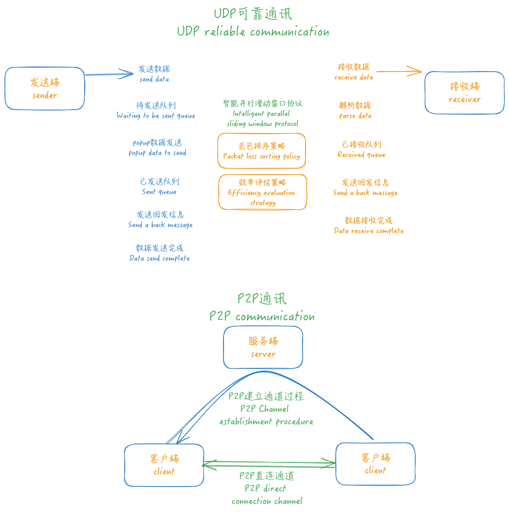

<h4 align="right">简体中文 | <strong><a href="README_en.md">English</a></strong></h4>


### 天佐.追日靴


||||
|--|--|--|
|操作系统|    ||
|编译器|       ||
|编程语言|          ||
# 简介


**天佐.追日靴** 高性能可靠UDP数据传输P2P通讯框架，可用于建立P2P环境，文件传输，数据通讯。基于UDP协议的内网穿透解决方案，轻松实现音视频会议中心，直播，远程桌面/文档演示等功能。

**传说:**
凭此靴可以日行千里、夜走八百，如生羽翼。渴欲得饮，饮于河渭，河渭不足，北饮大泽。未至，道渴而死。弃其杖，化为邓林。

# 目标
构建UDP可靠数据传输，按策略动态调整丢包率和传输性能，可方便搭建P2P通讯。



# 功能

- 🧩 集成简单
- 📊 高层协议实现数据通讯的稳定可靠, 可动态修改参数调整通讯策略.
- 🪡 可使用同一套接字初始化多个组件进行多线程数据通讯.
- 🔢 解决丢包: 采用自行研发的并行滑动窗口协议, 保证数据的稳定可靠传输.
- 🪟 动态调整: 数据通讯可行效率动态评估和计算获得当前环境下的最佳通讯表现.
- 👜 数据组帧: 通讯数据包发送分包, 接收组包, 保证数据顺序完整.

# 截图

**天佐.追日靴测试程序:**


# 例子
<details>
  <summary>cpp</summary>

```cpp
#include <iostream>
#include <thread>
#include "tianzuo.ZhuiriInterface.h" // 接口头文件 interface heaher file

#include <winsock.h>
#pragma comment(lib, "ws2_32.lib")

// 数据回调函数
void msg_recv_callback(void* context, Zhuiri_data_pkg_pointer data_pkg) {
    Zhuiri_data_pkg_struct data_new;
    memcpy(&data_new, data_pkg, sizeof(Zhuiri_data_pkg_struct));
    int send_size = data_pkg->m_data.get_send_size();
    if (send_size > Zhuiri_content_size) {
        char* send_data = new char[static_cast<unsigned int>(send_size)];
        memcpy(send_data, data_pkg->get_send_data(), static_cast<unsigned int>(send_size));
        data_new.set_send_data(send_data);
    } else {
        data_new.set_send_data(data_new.m_data.m_data);
    }
    tianzuo_DataQueue* const dataQueue = reinterpret_cast<tianzuo_DataQueue*>(context);
    dataQueue->push_back(&data_new);
}

// 接收线程
void recv_thread(tianzuo_DataQueue* data_queue_recv) {
    while (1) {
        Zhuiri_data_pkg_struct recv_msg;
        if (data_queue_recv->pop_up(&recv_msg) != Zhuiri_queue_error_code_success) {
            //std::cout << "pop_up no data" << std::endl;
            std::this_thread::sleep_for(std::chrono::milliseconds(200));
            continue;
        }

        std::cout << "recv data: " << recv_msg.m_data.m_data << std::endl;
        if (strcmp(recv_msg.m_data.m_data, "send data 99") == 0) {
            std::cout << "recv done" << std::endl;
            return;
        }
    }
}

int main() {

    // 初始化接口 initialize the interface
    std::unique_ptr<tianzuo_ZhuiriInterface> zhuiri_interface(new tianzuo_ZhuiriInterface());

    // 创建实例 create an instance
    tianzuo_ZhuiriInt* zhuiri = zhuiri_interface->initialize();

    // 初始化数据队列接口 initialize the data queue interface
    std::unique_ptr<tianzuo_DataQueueInterface> data_queue_interface(new tianzuo_DataQueueInterface());

    // 创建数据队列实例 create an data queue instance
    tianzuo_DataQueue* data_queue_recv = data_queue_interface->initialize();

    // 初始化实例 initialize the instance
    int port = 6666;
    int error_code = zhuiri->initialize(
        nullptr, port, reinterpret_cast<void*>(msg_recv_callback),
        data_queue_recv, 6000, false);
    if (error_code != Zhuiri_error_code_success) {
        std::cout << "initialize error: " << error_code;

        // 释放接口 terminate the interface
        if (data_queue_interface != nullptr && data_queue_recv != nullptr) {
            data_queue_interface->terminate(&data_queue_recv);
        }
        if (zhuiri_interface != nullptr && zhuiri != nullptr) {
            zhuiri_interface->terminate(&zhuiri);
        }
        return -1;
    }

    // 设置默认参数 set default parameters
    Zhuiri_param_struct param(0, 5168, 1024, 2280, 3, 5, 600);
    zhuiri->set_param(&param);

    // 启动接收线程 start receiving thread
    std::thread recv_th(recv_thread, data_queue_recv);

    // 开始发送数据 start sending data
    int data_size = 1024;
    char data[1024];
    memset(data, 0, data_size);
    int ip = ntohl(inet_addr("127.0.0.1"));
    for (size_t i = 0; i < 100; i++) {
        //std::cout << "start send index: " << i << std::endl;
        sprintf_s(data, data_size, "send data %d", i);
        int data_len = strlen(data);
        Zhuiri_send_param_struct send_param(0, ip, port, Zhuiri_data_sign_reliable, 7788, data, data_len);
        error_code = zhuiri->send(&send_param);
        if (error_code != Zhuiri_error_code_success) {
            std::cout << "send error: " << error_code;

            // 释放接口 terminate the interface
            if (data_queue_interface != nullptr && data_queue_recv != nullptr) {
                data_queue_interface->terminate(&data_queue_recv);
            }
            if (zhuiri_interface != nullptr && zhuiri != nullptr) {
                zhuiri_interface->terminate(&zhuiri);
            }
            return -1;
        }
        //std::this_thread::sleep_for(std::chrono::milliseconds(10));
    }
    std::cout << "send done" << std::endl;
    recv_th.join();

    // 释放接口 terminate the interface
    if (data_queue_interface != nullptr && data_queue_recv != nullptr) {
        data_queue_interface->terminate(&data_queue_recv);
    }
    if (zhuiri_interface != nullptr && zhuiri != nullptr) {
        zhuiri_interface->terminate(&zhuiri);
    }

    return 0;
}
```
</details>

<details>
  <summary>python</summary>

```python
from ctypes import *
from enum import Enum
import ctypes
import ipaddress

tianzuo_ZhuiriLib = cdll.LoadLibrary('./tianzuo.Zhuiri.dll')


class Zhuiri_error_code(Enum):
    Zhuiri_error_code_success       = 0x00000001                                     # 正确的值 (success)
    Zhuiri_error_code_no_rights     = 0x00000002                                     # 效验未通过 (no rights)
    Zhuiri_error_code_socket        = 0x0000000D                                     # 套接字错误 (socket error)
    Zhuiri_error_code_thread_error  = 0x00000021                                     # 线程失败 (thread error)
    Zhuiri_error_code_handle        = 0x00000022                                     # 创建句柄失败 (handle error)
    Zhuiri_error_code_out_of_cache  = 0x00000023                                     # 超出缓冲最大值 (out f cache)
    Zhuiri_error_code_out_of_memory = 0x00000024                                     # 内存溢出 (out of memory)
    Zhuiri_error_code_time_out      = 0x00000025                                     # 操作超时 (time out)
    Zhuiri_error_code_user_reject   = 0x00000098                                     # 对方决绝 (user reject)
    Zhuiri_error_code_user_exit     = 0x00000099                                     # 自行退出 (user exit)


class Zhuiri_queue_error_code(Enum):
    Zhuiri_queue_error_code_success       = 0x00000001                               # 正确的值 (success)
    Zhuiri_queue_error_code_invalid_value = 0x00000002                               # 无效的值 (invalid value)
    Zhuiri_queue_error_code_out_of_cache  = 0x00000003                               # 超出缓冲 (out f cache)
    Zhuiri_queue_error_code_out_of_memory = 0x00000004                               # 内存溢出 (out of memory)
    Zhuiri_queue_error_code_no_data       = 0x00000005                               # 无数据 (no data)


class Zhuiri_data_sign(Enum):
    Zhuiri_data_sign_none       = 0x00000000                                         # 无标识  (no sign)
    Zhuiri_data_sign_reliable   = 0x00000001                                         # 可靠    (reliable)
    Zhuiri_data_sign_processing = 0x00000002                                         # 处理中  (processing)
    Zhuiri_data_sign_response   = 0x00000003                                         # 回应消息 (response)
    Zhuiri_data_sign_heart      = 0x00000004                                         # 心跳包  (heart)


class tianzuo_ZhuiriInt:
    def __init__(self):
        tianzuo_ZhuiriLib.tianzuo_ZhuiriInterface_initialize.restype = c_void_p
        self.obj = tianzuo_ZhuiriLib.tianzuo_ZhuiriInterface_initialize()

    def __del__(self):
        tianzuo_ZhuiriLib.tianzuo_ZhuiriInterface_terminate.argtypes = [c_void_p]
        tianzuo_ZhuiriLib.tianzuo_ZhuiriInterface_terminate(self.obj)

    def initialize(self, ip_addr, port, callback, context, heart_check_time, log_trace, iocp):
        tianzuo_ZhuiriLib.tianzuo_ZhuiriInt_initialize.restype = c_int
        tianzuo_ZhuiriLib.tianzuo_ZhuiriInt_initialize.argtypes = [c_void_p, c_char_p, ctypes.c_int, c_void_p, c_void_p, ctypes.c_int, ctypes.c_int, c_void_p]
        return tianzuo_ZhuiriLib.tianzuo_ZhuiriInt_initialize(self.obj, ip_addr, port, callback, context, heart_check_time, log_trace, iocp)

    def set_param(self, sender_index, init_server_port, msg_init_size, recv_ex_data_max, retry_max, retry_all_number, init_retry_time):
        tianzuo_ZhuiriLib.tianzuo_ZhuiriInt_set_param.restype = c_int
        tianzuo_ZhuiriLib.tianzuo_ZhuiriInt_set_param.argtypes = [c_void_p, c_int, c_int, c_int, c_int, c_int, c_int, c_int]
        return tianzuo_ZhuiriLib.tianzuo_ZhuiriInt_set_param(self.obj, sender_index, init_server_port, msg_init_size, recv_ex_data_max, retry_max, retry_all_number, init_retry_time)

    def send(self, sender_index, ip, port, sign, function, send_data, send_size):
        tianzuo_ZhuiriLib.tianzuo_ZhuiriInt_send.restype = c_int
        tianzuo_ZhuiriLib.tianzuo_ZhuiriInt_send.argtypes = [c_void_p, c_int, c_int, c_int, c_int, c_int, c_char_p, c_int]
        return tianzuo_ZhuiriLib.tianzuo_ZhuiriInt_send(self.obj, sender_index, ip, port, sign, function, send_data, send_size)


class tianzuo_DataQueueInt:
    def __init__(self):
        tianzuo_ZhuiriLib.tianzuo_DataQueueInterface_initialize.restype = c_void_p
        self.obj = tianzuo_ZhuiriLib.tianzuo_DataQueueInterface_initialize()

    def __del__(self):
        tianzuo_ZhuiriLib.tianzuo_DataQueueInterface_terminate.argtypes = [c_void_p]
        tianzuo_ZhuiriLib.tianzuo_DataQueueInterface_terminate(self.obj)

    def initialize(self):
        tianzuo_ZhuiriLib.tianzuo_DataQueueInt_initialize.restype = c_void_p
        tianzuo_ZhuiriLib.tianzuo_DataQueueInt_initialize.argtypes = [c_void_p]
        return tianzuo_ZhuiriLib.tianzuo_DataQueueInt_initialize(self.obj)


callback_type = ctypes.CFUNCTYPE(c_void_p, c_void_p, c_void_p)


class Zhuiri_data_struct(ctypes.Structure):
    _fields_ = [("m_ip_adrs", ctypes.c_int),
                ("m_port", ctypes.c_int),
                ("m_function", ctypes.c_int),
                ("m_sign", ctypes.c_int),
                ("m_index", ctypes.c_int),
                ("m_send_time", ctypes.c_int),
                ("m_send_size", ctypes.c_int),
                ("m_data", ctypes.c_char * 492)]


class Zhuiri_data_pkg_struct(ctypes.Structure):
    _fields_ = [("m_data", Zhuiri_data_struct),
                ("m_send_data", ctypes.c_char_p),
                ("m_Zhuiri", ctypes.c_void_p),
                ("m_user_data", ctypes.c_void_p)]


def msg_recv_callback(context, pData):
    data = ctypes.cast(pData, ctypes.POINTER(Zhuiri_data_pkg_struct)).contents
    print("recv data:", data.m_data.m_data)


def main():
    # 初始化接口 initialize the interface
    print("initialize the interface")

    # 创建实例 create an instance
    data_queue_recv = tianzuo_DataQueueInt()
    pdata_queue_recv = ctypes.pointer(ctypes.py_object(data_queue_recv))

    pmsg_recv_callback = callback_type(msg_recv_callback)
	
    Zhuiri = tianzuo_ZhuiriInt()
    port = 6666
    error_code = Zhuiri.initialize(None, port, pmsg_recv_callback, pdata_queue_recv, 6000, False, None)
    if error_code != Zhuiri_error_code.Zhuiri_error_code_success.value:
        print("initialize error:", error_code)
        return

    # 设置默认参数 set default parameters
    Zhuiri.set_param(0, 5168, 1024, 2280, 3, 5, 600)

    # 开始发送数据 start sending data
    ip = int(ipaddress.IPv4Address("127.0.0.1"))
    for i in range(100):
        data = "send data {}".format(i)
        data_len = len(data)
        bytes_string = data.encode('utf-8')
        error_code = Zhuiri.send(0, ip, port, Zhuiri_data_sign.Zhuiri_data_sign_reliable.value, 7788, bytes_string, data_len)
        if error_code != Zhuiri_error_code.Zhuiri_error_code_success.value:
            print("send error:", error_code)
            return

    print("test done")


if __name__ == '__main__':
    main()

```
</details>

<details>
  <summary>java</summary>

```java
package cn.camelsoft;

import com.sun.jna.Library;
import com.sun.jna.Native;
import com.sun.jna.Pointer;
import com.sun.jna.Callback;
import com.sun.jna.CallbackReference;
import com.sun.jna.ptr.IntByReference;
import java.net.InetAddress;
import java.net.UnknownHostException;

enum Zhuiri_error_code {
    Zhuiri_error_code_success       (0x00000001),                                     ///< 正确的值 (success)
    Zhuiri_error_code_no_rights     (0x00000002),                                     ///< 效验未通过 (no rights)
    Zhuiri_error_code_socket        (0x0000000D),                                     ///< 套接字错误 (socket error)
    Zhuiri_error_code_thread_error  (0x00000021),                                     ///< 线程失败 (thread error)
    Zhuiri_error_code_handle        (0x00000022),                                     ///< 创建句柄失败 (handle error)
    Zhuiri_error_code_out_of_cache  (0x00000023),                                     ///< 超出缓冲最大值 (out f cache)
    Zhuiri_error_code_out_of_memory (0x00000024),                                     ///< 内存溢出 (out of memory)
    Zhuiri_error_code_time_out      (0x00000025),                                     ///< 操作超时 (time out)
    Zhuiri_error_code_user_reject   (0x00000098),                                     ///< 对方决绝 (user reject)
    Zhuiri_error_code_user_exit     (0x00000099);                                     ///< 自行退出 (user exit)
    private int value;
    Zhuiri_error_code(int value) {
        this.value = value;
    }
    public int getValue() {
        return value;
    }
};

enum Zhuiri_data_sign {
    Zhuiri_data_sign_none       (0x00000000),                                         ///< 无标识  (no sign)
    Zhuiri_data_sign_reliable   (0x00000001),                                         ///< 可靠    (reliable)
    Zhuiri_data_sign_processing (0x00000002),                                         ///< 处理中  (processing)
    Zhuiri_data_sign_response   (0x00000003),                                         ///< 回应消息 (response)
    Zhuiri_data_sign_heart      (0x00000004);                                         ///< 心跳包  (heart)
    private int value;
    Zhuiri_data_sign(int value) {
        this.value = value;
    }
    public int getValue() {
        return value;
    }
};

interface tianzuo_ZhuiriLib extends Library {
    tianzuo_ZhuiriLib instance = (tianzuo_ZhuiriLib) Native.load("./tianzuo.Zhuiri.dll", tianzuo_ZhuiriLib.class);
    Pointer tianzuo_ZhuiriInterface_initialize();
    void tianzuo_ZhuiriInterface_terminate(Pointer zhuiri);
    int tianzuo_ZhuiriInt_initialize(Pointer zhuiri, String ip_addr, int port, Pointer callback, Pointer context, int heart_check_time, Boolean log_trace, Pointer iocp);
    int tianzuo_ZhuiriInt_set_param(Pointer zhuiri, int sender_index, int init_server_port, int msg_init_size, int recv_ex_data_max, int retry_max, int retry_all_number, int init_retry_time);
    int tianzuo_ZhuiriInt_send(Pointer zhuiri, int sender_index, int ip, int port, int sign, int function, String send_data, int send_size);
}

interface tianzuo_DataQueueLib extends Library {
    tianzuo_DataQueueLib instance = (tianzuo_DataQueueLib) Native.load("./tianzuo.Zhuiri.dll", tianzuo_DataQueueLib.class);
    Pointer tianzuo_DataQueueInterface_initialize();
    void tianzuo_DataQueueInterface_terminate(Pointer DataQueue);
    int tianzuo_DataQueueInt_initialize(Pointer DataQueue);
}

interface MyCallback extends Callback {
    void callbackFunction(Pointer context, Pointer pData);
}
class MyCallbackImpl implements MyCallback {

    @Override
    public void callbackFunction(Pointer context, Pointer pData) {
        Zhuiri_data_pkg_struct data_pkg = new Zhuiri_data_pkg_struct(pData);
        String str = new String(data_pkg.m_data.m_data).trim();
        System.out.printf("recv data: %s\n", str);
    }
}

public class Main {
    public static int ipToInt(String ipAddress) {
        try {
            InetAddress inetAddress = InetAddress.getByName(ipAddress);
            byte[] bytes = inetAddress.getAddress();

            int result = 0;
            for (byte b : bytes) {
                result = result << 8 | (b & 0xFF);
            }

            return result;
        } catch (UnknownHostException e) {
            System.err.println("Invalid IP address: " + ipAddress);
            return 0;
        }
    }

    public static void main(String[] args) {

        System.setProperty("jna.encoding","UTF-8");

        // 初始化接口 initialize the interface
        System.out.printf("initialize the interface\n");

        // 创建实例 create an instance
        Pointer data_queue_recv = tianzuo_DataQueueLib.instance.tianzuo_DataQueueInterface_initialize();

        MyCallback callback = new MyCallbackImpl();
        Pointer pcallback = CallbackReference.getFunctionPointer(callback);

        Pointer zhuiri = tianzuo_ZhuiriLib.instance.tianzuo_ZhuiriInterface_initialize();
        int port = 6666;
        int error_code = tianzuo_ZhuiriLib.instance.tianzuo_ZhuiriInt_initialize(zhuiri, null, port, pcallback, data_queue_recv, 6000, false, null);
        if (error_code != Zhuiri_error_code.Zhuiri_error_code_success.getValue()) {
            System.out.printf("tianzuo_QiankunInt_initialize error: %d\n", error_code);
            return;
        }

        // 设置默认参数 set default parameters
        tianzuo_ZhuiriLib.instance.tianzuo_ZhuiriInt_set_param(zhuiri, 0, 5168, 1024, 2280, 3, 5, 600);

        // 开始发送数据 start sending data
        String ipAddress = "127.0.0.1";
        int ip = ipToInt(ipAddress);
        int sport = 6666;
        for (int i = 0; i < 100; i++) {
            String data = String.format("send data %d ", i);
            int data_len = data.length();
            int error_code2 = tianzuo_ZhuiriLib.instance.tianzuo_ZhuiriInt_send(zhuiri, 0, ip, sport, Zhuiri_data_sign.Zhuiri_data_sign_reliable.getValue(), 7788, data, data_len);
            if (error_code2 != Zhuiri_error_code.Zhuiri_error_code_success.getValue()) {
                System.out.printf("tianzuo_ZhuiriInt_send error: %d\n", error_code2);
                return;
            }
        }
		
		System.out.printf("test done\n");
    }
}
```
</details>

<details>
  <summary>csharp</summary>

```csharp


using System.Collections;
using System.Net;
using System.Runtime.InteropServices;
using System.Text;

public enum Zhuiri_error_code
{
    Zhuiri_error_code_success       = 0x00000001,                                     ///< 正确的值 (success)
    Zhuiri_error_code_no_rights     = 0x00000002,                                     ///< 效验未通过 (no rights)
    Zhuiri_error_code_socket        = 0x0000000D,                                     ///< 套接字错误 (socket error)
    Zhuiri_error_code_thread_error  = 0x00000021,                                     ///< 线程失败 (thread error)
    Zhuiri_error_code_handle        = 0x00000022,                                     ///< 创建句柄失败 (handle error)
    Zhuiri_error_code_out_of_cache  = 0x00000023,                                     ///< 超出缓冲最大值 (out f cache)
    Zhuiri_error_code_out_of_memory = 0x00000024,                                     ///< 内存溢出 (out of memory)
    Zhuiri_error_code_time_out      = 0x00000025,                                     ///< 操作超时 (time out)
    Zhuiri_error_code_user_reject   = 0x00000098,                                     ///< 对方决绝 (user reject)
    Zhuiri_error_code_user_exit     = 0x00000099,                                     ///< 自行退出 (user exit)
}

public enum Zhuiri_data_sign
{
    Zhuiri_data_sign_none       = 0x00000000,                                         ///< 无标识  (no sign)
    Zhuiri_data_sign_reliable   = 0x00000001,                                         ///< 可靠    (reliable)
    Zhuiri_data_sign_processing = 0x00000002,                                         ///< 处理中  (processing)
    Zhuiri_data_sign_response   = 0x00000003,                                         ///< 回应消息 (response)
    Zhuiri_data_sign_heart      = 0x00000004,                                         ///< 心跳包  (heart)
};

public struct Zhuiri_data_struct
{
    public Zhuiri_data_struct()
    {
    }
    public int m_ip_adrs;
    public int m_port;
    public int m_function;
    public int m_sign;
    public int m_index;
    public int m_send_time;
    public int m_send_size;
    [MarshalAs(UnmanagedType.ByValArray, SizeConst = 492)]
    public byte[] m_data;
}

public struct Zhuiri_data_pkg_struct
{
    public Zhuiri_data_pkg_struct()
    {
    }
    public Zhuiri_data_struct m_data;
    public IntPtr m_send_data;
    public IntPtr m_Zhuiri;
    public IntPtr m_user_data;
}

public delegate void CallbackDelegate(IntPtr context, IntPtr pData);

class Program
{
    [DllImport("tianzuo.Zhuiri.dll")]
    public static extern IntPtr tianzuo_ZhuiriInterface_initialize();
    [DllImport("tianzuo.Zhuiri.dll")]
    public static extern void tianzuo_ZhuiriInterface_terminate(IntPtr Zhuiri);
    [DllImport("tianzuo.Zhuiri.dll")]
    public static extern int tianzuo_ZhuiriInt_initialize(IntPtr Zhuiri, string ip_addr, int port, IntPtr callback, IntPtr context, int heart_check_time, bool log_trace, IntPtr iocp);
    [DllImport("tianzuo.Zhuiri.dll")]
    public static extern IntPtr tianzuo_DataQueueInterface_initialize();
    [DllImport("tianzuo.Zhuiri.dll")]
    public static extern int tianzuo_ZhuiriInt_set_param(IntPtr Zhuiri, int sender_index, int init_server_port, int msg_init_size, int recv_ex_data_max, int retry_max, int retry_all_number, int init_retry_time);
    [DllImport("tianzuo.Zhuiri.dll")]
    public static extern int tianzuo_ZhuiriInt_send(IntPtr Zhuiri, int sender_index, int ip, int port, int sign, int function, string send_data, int send_size);

    static void MyCallback(IntPtr context, IntPtr pData)
    {
        Zhuiri_data_pkg_struct data = Marshal.PtrToStructure<Zhuiri_data_pkg_struct>(pData);
        string str = Encoding.ASCII.GetString(data.m_data.m_data);
        Console.WriteLine("recv data:" + str);
    }

    static void Main(string[] args)
    {
        // 初始化接口 initialize the interface
        Console.WriteLine("initialize the interface\n");

        // 创建实例 create an instance
        IntPtr data_queue_recv = tianzuo_DataQueueInterface_initialize();

        CallbackDelegate callback = new CallbackDelegate(MyCallback);
        IntPtr callbackPtr = Marshal.GetFunctionPointerForDelegate(callback);

        IntPtr zhuiri = tianzuo_ZhuiriInterface_initialize();
        int port = 6666;
        int error_code = tianzuo_ZhuiriInt_initialize(zhuiri, null, port, callbackPtr, data_queue_recv, 6000, false, 0);
        if (error_code != ((int)Zhuiri_error_code.Zhuiri_error_code_success))
        {
            Console.WriteLine("tianzuo_ZhuiriInt_initialize error:" + error_code);
            return;
        }

        // 设置默认参数 set default parameters
        tianzuo_ZhuiriInt_set_param(zhuiri, 0, 5168, 1024, 2280, 3, 5, 600);

        // 开始发送数据 start sending data
        string ipAddressString = "127.0.1.1";
        IPAddress ipAddress = IPAddress.Parse(ipAddressString);
        byte[] bytes = ipAddress.GetAddressBytes();
        if (BitConverter.IsLittleEndian)
        {
            Array.Reverse(bytes);
        }
        int ip = BitConverter.ToInt32(bytes, 0);
        int sport = 6666;
        for (int i = 0; i < 100; i++)
        {
            string data = String.Format("send data {0}", i);
            int data_len = data.Length;
            error_code = tianzuo_ZhuiriInt_send(zhuiri, 0, ip, sport, (int)Zhuiri_data_sign.Zhuiri_data_sign_reliable, 7788, data, data_len);
            if (error_code != ((int)Zhuiri_error_code.Zhuiri_error_code_success))
            {
                Console.WriteLine("tianzuo_ZhuiriInt_send error:" + error_code);
                return;
            }
        }

        Console.WriteLine("test done");
    }
}

```
</details>

<details>
  <summary>javascript</summary>

```js


Zhuiri_error_code_success       = 0x00000001;                                     ///< 正确的值 (success)
Zhuiri_error_code_no_rights     = 0x00000002;                                     ///< 效验未通过 (no rights)
Zhuiri_error_code_socket        = 0x0000000D;                                     ///< 套接字错误 (socket error)
Zhuiri_error_code_thread_error  = 0x00000021;                                     ///< 线程失败 (thread error)
Zhuiri_error_code_handle        = 0x00000022;                                     ///< 创建句柄失败 (handle error)
Zhuiri_error_code_out_of_cache  = 0x00000023;                                     ///< 超出缓冲最大值 (out f cache)
Zhuiri_error_code_out_of_memory = 0x00000024;                                     ///< 内存溢出 (out of memory)
Zhuiri_error_code_time_out      = 0x00000025;                                     ///< 操作超时 (time out)
Zhuiri_error_code_user_reject   = 0x00000098;                                     ///< 对方决绝 (user reject)
Zhuiri_error_code_user_exit     = 0x00000099;                                     ///< 自行退出 (user exit)

Zhuiri_data_sign_none           = 0x00000000;                                     ///< 无标识  (no sign)
Zhuiri_data_sign_reliable       = 0x00000001;                                     ///< 可靠    (reliable)
Zhuiri_data_sign_processing     = 0x00000002;                                     ///< 处理中  (processing)
Zhuiri_data_sign_response       = 0x00000003;                                     ///< 回应消息 (response)
Zhuiri_data_sign_heart          = 0x00000004;                                     ///< 心跳包  (heart)

let ffi = require('ffi-napi')
const ref = require('ref-napi');

let tianzuo_ZhuiriLib = ffi.Library("tianzuo.Zhuiri.dll", {
    'tianzuo_ZhuiriInterface_initialize': ['pointer', []],
    'tianzuo_ZhuiriInterface_terminate':['void',['pointer']],
    'tianzuo_ZhuiriInt_initialize':['int',['pointer','pointer','int','pointer','pointer','int', 'bool','pointer']],
    'tianzuo_ZhuiriInt_set_param':['int',['pointer','int','int','int','int','int','int','int']],
    'tianzuo_ZhuiriInt_send':['int',['pointer','int','int','int','int','int','string','int']],
    'tianzuo_DataQueueInterface_initialize': ['pointer', []],
    'tianzuo_DataQueueInterface_terminate':['void',['pointer']],
})

function ipToInt(ip) {
    let parts = ip.split('.').map(Number);
    return (parts[0] << 24) + (parts[1] << 16) + (parts[2] << 8) + parts[3];
}

function sleep(ms) {
    return new Promise(resolve => setTimeout(resolve, ms));
}

async function main() {

    // 初始化接口 initialize the interface
    console.log("initialize the interface\n");

    // 创建实例 create an instance
    let data_queue_recv = tianzuo_ZhuiriLib.tianzuo_DataQueueInterface_initialize();

    const callback = ffi.Callback('void', ['pointer', 'pointer'], function(context, pData) {
        const data = pData.readCString(4*7);
        console.log(`recv data: ${data}`);
    });

    let port = 5555;
    let zhuiri = tianzuo_ZhuiriLib.tianzuo_ZhuiriInterface_initialize();
    let error_code = tianzuo_ZhuiriLib.tianzuo_ZhuiriInt_initialize(zhuiri, null, port, callback, data_queue_recv, 6000, false, null);
    if (error_code !== Zhuiri_error_code_success) {
        console.log("tianzuo_ZhuiriInt_initialize error: %d\n", error_code);
        return;
    }

    // 设置默认参数 set default parameters
    tianzuo_ZhuiriLib.tianzuo_ZhuiriInt_set_param(zhuiri, 0, 5168, 1024, 2280, 3, 5, 600);

    // 开始发送数据 start sending data
    const ipString = '127.0.0.1';
    const ip = ipToInt(ipString);
    let sport = 6666;

    for (let i = 0; i < 10; i++) {
        const data = `send data ${i}`;
        const data_len = data.length;
        error_code = tianzuo_ZhuiriLib.tianzuo_ZhuiriInt_send(zhuiri, 0, ip, sport, Zhuiri_data_sign_reliable, 7788, data, data_len);
        if (error_code !== Zhuiri_error_code_success) {
            console.log("tianzuo_ZhuiriInt_send error: %d\n", error_code);
            return;
        }
    }
    await sleep(20000);
}

main();

console.log("test done\n");


```
</details>

<details>
  <summary>php</summary>

```php
<?php

// 检查是否加载了 FFI 扩展
if (extension_loaded('ffi')) {
    echo("已启用 FFI 扩展\n");
} else {
    die("未启动 FFI 扩展\n");
}

enum Zhuiri_error_code
{
const Zhuiri_error_code_success       = 0x00000001;                                     ///< 正确的值 (success)
const Zhuiri_error_code_no_rights     = 0x00000002;                                     ///< 效验未通过 (no rights)
const Zhuiri_error_code_socket        = 0x0000000D;                                     ///< 套接字错误 (socket error)
const Zhuiri_error_code_thread_error  = 0x00000021;                                     ///< 线程失败 (thread error)
const Zhuiri_error_code_handle        = 0x00000022;                                     ///< 创建句柄失败 (handle error)
const Zhuiri_error_code_out_of_cache  = 0x00000023;                                     ///< 超出缓冲最大值 (out f cache)
const Zhuiri_error_code_out_of_memory = 0x00000024;                                     ///< 内存溢出 (out of memory)
const Zhuiri_error_code_time_out      = 0x00000025;                                     ///< 操作超时 (time out)
const Zhuiri_error_code_user_reject   = 0x00000098;                                     ///< 对方决绝 (user reject)
const Zhuiri_error_code_user_exit     = 0x00000099;                                     ///< 自行退出 (user exit)
};

enum Zhuiri_data_sign
{
const Zhuiri_data_sign_none           = 0x00000000;                                     ///< 无标识  (no sign)
const Zhuiri_data_sign_reliable       = 0x00000001;                                     ///< 可靠    (reliable)
const Zhuiri_data_sign_processing     = 0x00000002;                                     ///< 处理中  (processing)
const Zhuiri_data_sign_response       = 0x00000003;                                     ///< 回应消息 (response)
const Zhuiri_data_sign_heart          = 0x00000004;                                     ///< 心跳包  (heart)
};

$ffi = FFI::cdef("
    void* tianzuo_ZhuiriInterface_initialize();
    void tianzuo_ZhuiriInterface_terminate(void* *ZhuiriInt_pointer);
    int tianzuo_ZhuiriInt_initialize(void* ZhuiriInt_pointer, const char* ip_addr, int port, const void* callback, const void* context, int const heart_check_time, bool log_trace, void* iocp);
    int tianzuo_ZhuiriInt_set_param(void* ZhuiriInt_pointer, int sender_index, int init_server_port, int msg_init_size, int recv_ex_data_max, int retry_max, int retry_all_number, int init_retry_time);
    int tianzuo_ZhuiriInt_send(void* ZhuiriInt_pointer, int sender_index, int ip, int port, int sign, int function, char* send_data, int send_size);
    void* tianzuo_DataQueueInterface_initialize();
    void tianzuo_DataQueueInterface_terminate(void* *DataQueue_pointer);
    typedef unsigned(*Zhuiri_callback)(const void *context, const void *pData);
", "tianzuo.Zhuiri.dll");

# 初始化接口 initialize the interface
echo "initialize the interface" . "\n";

# 创建实例 create an instance
$data_queue_recv = $ffi->tianzuo_DataQueueInterface_initialize();


//function myCallback($context, $pData) {
//    echo "phpCallback" . "\n";
//}
//
//// Define the callback function signature
//$callback = function($context, $pData) {
//    myCallback($context, $pData);
//};
//
//$callableCallback = FFI::addr($callback);


//$phpCallback = function($context, $pData): void {
//    echo "phpCallback" . "\n";
//};
//$callback= FFI::new("Zhuiri_callback", $phpCallback);


$callback = $ffi->callback("void(const char*)", function($message) {
    echo "Callback message: $message\n";
});


$port = 6666;
$zhuiri = $ffi->tianzuo_ZhuiriInterface_initialize();
$error_code = $ffi->tianzuo_ZhuiriInt_initialize($zhuiri, null, $port, $callback, $data_queue_recv, 6000, False, null);
if ($error_code != Zhuiri_error_code::Zhuiri_error_code_success) {
    echo "initialize error: " . $error_code . "\n";
    return;
}

# 设置默认参数 set default parameters
$ffi->tianzuo_ZhuiriInt_set_param($zhuiri, 0, 5168, 1024, 2280, 3, 5, 600);

# 开始发送数据 start sending data
$ip = ip2long("127.0.0.1");
for ($i = 0; $i < 10; $i++) {
    $data = sprintf("send data %d", $i);
    $data_len = strlen($data);
    echo "ip: " . $ip . "\n";
    echo "port: " . $port . "\n";
    echo "send data: " . $data . "\n";
    echo "data_len: " . $data_len . "\n";
    $error_code = $ffi->tianzuo_ZhuiriInt_send($zhuiri, 0, $ip, $port, Zhuiri_data_sign::Zhuiri_data_sign_reliable, 7788, $data, $data_len);
    if ($error_code != Zhuiri_error_code::Zhuiri_error_code_success) {
        echo "send error: " . $error_code . "\n";
        return;
    }
}

echo "test done" . "\n";


?>
```
</details>

<details>
  <summary>vb</summary>

```vb

Imports System.IO
Imports System.Net
Imports System.Runtime.InteropServices
Imports System.Runtime.InteropServices.JavaScript.JSType
Imports System.Text

Enum Zhuiri_error_code
    Zhuiri_error_code_success = 1                                            ' 正确的值 (success)
    Zhuiri_error_code_no_rights = 2                                          ' 效验未通过 (no rights)
    Zhuiri_error_code_socket = 13                                            ' 套接字错误 (socket Error)
    Zhuiri_error_code_thread_error = 21                                      ' 线程失败 (thread Error)
    Zhuiri_error_code_handle = 22                                            ' 创建句柄失败 (handle Error)
    Zhuiri_error_code_out_of_cache = 23                                      ' 超出缓冲最大值 (out f cache)
    Zhuiri_error_code_out_of_memory = 24                                     ' 内存溢出 (out Of memory)
    Zhuiri_error_code_time_out = 25                                          ' 操作超时 (time out)
    Zhuiri_error_code_user_reject = 98                                       ' 对方决绝 (user reject)
    Zhuiri_error_code_user_exit = 99                                         ' 自行退出 (user Exit)
End Enum

Enum Zhuiri_data_sign
    Zhuiri_data_sign_none = 0                                               ' 无标识  (no sign)
    Zhuiri_data_sign_reliable = 1                                           ' 可靠    (reliable)
    Zhuiri_data_sign_processing = 2                                         ' 处理中  (processing)
    Zhuiri_data_sign_response = 3                                           ' 回应消息 (response)
    Zhuiri_data_sign_heart = 4                                              ' 心跳包  (heart)
End Enum

Structure Zhuiri_data_struct
    Public m_ip_adrs As Integer
    Public m_port As Integer
    Public m_function As Integer
    Public m_sign As Integer
    Public m_index As Integer
    Public m_send_time As Integer
    Public m_send_size As Integer
    <MarshalAs(UnmanagedType.ByValArray, SizeConst:=492)>
    Public m_data As Byte()
End Structure

Structure Zhuiri_data_pkg_struct
    Public m_data As Zhuiri_data_struct
    Public m_send_data As IntPtr
    Public m_Zhuiri As IntPtr
    Public m_user_data As IntPtr
End Structure

Module Program
    <DllImport("tianzuo.Zhuiri.dll")>
    Public Function tianzuo_ZhuiriInterface_initialize() As IntPtr
    End Function
    <DllImport("tianzuo.Zhuiri.dll")>
    Public Function tianzuo_ZhuiriInterface_terminate(ByRef ZhuiriInt_pointer As IntPtr)
    End Function
    <DllImport("tianzuo.Zhuiri.dll")>
    Public Function tianzuo_ZhuiriInt_initialize(ZhuiriInt_pointer As IntPtr, ip_addr As String, port As Integer,
        callback As IntPtr, context As IntPtr, heart_check_time As Integer, log_trace As Boolean, iocp As IntPtr) As Integer
    End Function
    <DllImport("tianzuo.Zhuiri.dll")>
    Public Function tianzuo_ZhuiriInt_set_param(ZhuiriInt_pointer As IntPtr,
        sender_index As Integer, init_server_port As Integer, msg_init_size As Integer,
        recv_ex_data_max As Integer, retry_max As Integer, retry_all_number As Integer,
        init_retry_time As Integer) As Integer
    End Function
    <DllImport("tianzuo.Zhuiri.dll")>
    Public Function tianzuo_ZhuiriInt_send(ZhuiriInt_pointer As IntPtr,
        sender_index As Integer, ip As Integer, port As Integer, sign As Integer, func As Integer, send_data As String, send_size As Integer) As Integer
    End Function
    <DllImport("tianzuo.Zhuiri.dll")>
    Public Function tianzuo_DataQueueInterface_initialize() As IntPtr
    End Function
    <DllImport("tianzuo.Zhuiri.dll")>
    Public Function tianzuo_DataQueueInterface_terminate(ByRef DataQueue_pointer As IntPtr)
    End Function

    Public Delegate Sub CallbackFunc(context As IntPtr, pData As IntPtr)

    Public Sub msg_recv_callback(context As IntPtr, pData As IntPtr)
        Dim data As Zhuiri_data_pkg_struct = Marshal.PtrToStructure(Of Zhuiri_data_pkg_struct)(pData)
        Dim Str As String = Encoding.ASCII.GetString(data.m_data.m_data)
        Console.WriteLine("recv data:" + Str)
    End Sub

    Sub Main(args As String())

        ' 初始化接口 initialize the interface
        Console.WriteLine("initialize the interface")

        ' 创建实例 create an instance
        Dim data_queue_recv As IntPtr = tianzuo_DataQueueInterface_initialize()
        Dim callbackDelegate As CallbackFunc = AddressOf msg_recv_callback
        Dim callbackPtr As IntPtr = Marshal.GetFunctionPointerForDelegate(callbackDelegate)

        Dim port As Integer = 6666
        Dim Zhuiri As IntPtr = tianzuo_ZhuiriInterface_initialize()
        Dim error_code As Integer = tianzuo_ZhuiriInt_initialize(Zhuiri, IntPtr.Zero, port, callbackPtr, data_queue_recv, 6000, False, IntPtr.Zero)
        If (error_code <> Zhuiri_error_code.Zhuiri_error_code_success) Then
            Console.WriteLine("tianzuo_ZhuiriInt_initialize error:" + error_code.ToString)
            Return
        End If

        ' 设置默认参数 Set Default parameters
        tianzuo_ZhuiriInt_set_param(Zhuiri, 0, 5168, 1024, 2280, 3, 5, 600)

        ' 开始发送数据 start sending data
        Dim ipAddressString As String = "127.0.1.1"
        Dim ipAddress As IPAddress = IPAddress.Parse(ipAddressString)
        Dim bytes As Byte() = ipAddress.GetAddressBytes()
        If (BitConverter.IsLittleEndian) Then
            Array.Reverse(bytes)
        End If
        Dim ip As Integer = BitConverter.ToInt32(bytes, 0)
        Dim sport As Integer = 6666
        For i As Integer = 0 To 99
            Dim data As String = String.Format("send data {0}", i)
            Dim data_len As Integer = data.Length
            error_code = tianzuo_ZhuiriInt_send(Zhuiri, 0, ip, sport, Zhuiri_data_sign.Zhuiri_data_sign_reliable, 7788, data, data_len)
            If (error_code <> Zhuiri_error_code.Zhuiri_error_code_success) Then
                Console.WriteLine("tianzuo_ZhuiriInt_send error:" + error_code.ToString)
                Return
            End If
        Next

        Console.WriteLine("test done -------------------")

    End Sub
End Module

```
</details>

<details>
  <summary>go</summary>

```go
package main

/*
#include "tianzuo.ZhuiriInterface.h"
void msg_recv_callback_cgo(const void *context, const void *pData);
*/
import "C"
import (
	"fmt"
	"net"
	"syscall"
	"unsafe"
)

const (
	Zhuiri_error_code_success       = 1  // 正确的值 (success)
	Zhuiri_error_code_no_rights     = 2  // 效验未通过 (no rights)
	Zhuiri_error_code_socket        = 13 // 套接字错误 (socket error)
	Zhuiri_error_code_thread_error  = 21 // 线程失败 (thread error)
	Zhuiri_error_code_handle        = 22 // 创建句柄失败 (handle error)
	Zhuiri_error_code_out_of_cache  = 23 // 超出缓冲最大值 (out f cache)
	Zhuiri_error_code_out_of_memory = 24 // 内存溢出 (out of memory)
	Zhuiri_error_code_time_out      = 25 // 操作超时 (time out)
	Zhuiri_error_code_user_reject   = 98 // 对方决绝 (user reject)
	Zhuiri_error_code_user_exit     = 99 // 自行退出 (user exit)
)

const (
	Zhuiri_data_sign_none       = 0 // 无标识  (no sign)
	Zhuiri_data_sign_reliable   = 1 // 可靠    (reliable)
	Zhuiri_data_sign_processing = 2 // 处理中  (processing)
	Zhuiri_data_sign_response   = 3 // 回应消息 (response)
	Zhuiri_data_sign_heart      = 4 // 心跳包  (heart)
)

func ipToInt(ip net.IP) uint32 {
	ip = ip.To4()
	if ip == nil {
		return 0
	}

	ipInt := uint32(ip[0])<<24 | uint32(ip[1])<<16 | uint32(ip[2])<<8 | uint32(ip[3])
	return ipInt
}

type Zhuiri_data_pkg_struct C.Zhuiri_data_pkg_struct

//export msg_recv_callback
func msg_recv_callback(context unsafe.Pointer, pData unsafe.Pointer) {
	data := *(*Zhuiri_data_pkg_struct)(unsafe.Pointer(pData))
	charArray := data.m_data.m_data
	goStr := C.GoString((*C.char)(unsafe.Pointer(&charArray[0])))
	fmt.Println("recv data:", goStr)
}

func main() {
	// 初始化接口 initialize the interface
	dll := syscall.MustLoadDLL("tianzuo.Zhuiri.dll")

	// 创建实例 create an instance
	tianzuo_DataQueueInterface_initialize := dll.MustFindProc("tianzuo_DataQueueInterface_initialize")
	data_queue_recv, _, _ := tianzuo_DataQueueInterface_initialize.Call()

	tianzuo_ZhuiriInterface_initialize := dll.MustFindProc("tianzuo_ZhuiriInterface_initialize")
	Zhuiri, _, _ := tianzuo_ZhuiriInterface_initialize.Call()

	var ip uintptr
	port := 6666
	var iocp uintptr
	tianzuo_ZhuiriInt_initialize := dll.MustFindProc("tianzuo_ZhuiriInt_initialize")
	msg_recv_callback_ptr := uintptr(unsafe.Pointer(C.msg_recv_callback_cgo))
	error_code, _, _ := tianzuo_ZhuiriInt_initialize.Call(Zhuiri, ip, uintptr(C.int(port)), msg_recv_callback_ptr, data_queue_recv, 6000, uintptr(C.int(0)), iocp)
	if error_code != Zhuiri_error_code_success {
		fmt.Println("tianzuo_ZhuiriInt_initialize error: ", error_code)
	}

	// 设置默认参数 set default parameters
	tianzuo_ZhuiriInt_set_param := dll.MustFindProc("tianzuo_ZhuiriInt_set_param")
	tianzuo_ZhuiriInt_set_param.Call(Zhuiri, 0, 5168, 1024, 2280, 3, 5, 600)

	// 开始发送数据 start sending data
	ipStr := "127.0.0.1"
	ipint := net.ParseIP(ipStr)
	nip := ipToInt(ipint)
	tianzuo_ZhuiriInt_send := dll.MustFindProc("tianzuo_ZhuiriInt_send")
	for i := 0; i < 100; i++ {
		data := "send data %d"
		gdata := fmt.Sprintf(data, i)
		cdata := C.CString(gdata)
		gdata_len := len(gdata)
		data_len := C.int(gdata_len)
		error_code, _, _ = tianzuo_ZhuiriInt_send.Call(Zhuiri, 0, uintptr(C.int(nip)), uintptr(C.int(port)), Zhuiri_data_sign_reliable, 7788, uintptr(unsafe.Pointer(cdata)), uintptr(data_len))
		if error_code != Zhuiri_error_code_success {
			fmt.Println("tianzuo_ZhuiriInt_send error: ", error_code)
			return
		}
	}

	fmt.Println("test done -------------------")
}

```
</details>

<details>
  <summary>rust</summary>

```rust

use std::os::raw::c_char;
use std::ffi::{c_int};
use std::ffi::CString;
use std::ptr::null;
use std::mem;

type CallbackFunc = extern "C" fn(context: *mut std::ffi::c_void, pData: *mut std::ffi::c_void);

struct Zhuiri_data_struct {
    m_ip_adrs: i32,
    m_port: i32,
    m_function: i32,
    m_sign: i32,
    m_index: i32,
    m_send_time: i32,
    m_send_size: i32,
    m_data: [u8; 492],
}

struct Zhuiri_data_pkg_struct {
    m_data: Zhuiri_data_struct,
    m_send_data: *const c_char,
    m_Zhuiri: *mut std::ffi::c_void,
    m_user_data: *mut std::ffi::c_void,
}

#[link(name = "tianzuo.Zhuiri")]
extern {
    fn tianzuo_ZhuiriInterface_initialize() -> *mut std::ffi::c_void;
    fn tianzuo_ZhuiriInterface_terminate(obj: *mut std::ffi::c_void);
    fn tianzuo_ZhuiriInt_initialize(obj: *mut std::ffi::c_void, ip_addr: *const c_char, port: c_int, callback: *mut std::ffi::c_void, context: *mut std::ffi::c_void, heart_check_time: c_int, log_trace: c_int, iocp: *const std::ffi::c_void) -> c_int;
    fn tianzuo_ZhuiriInt_set_param(obj: *mut std::ffi::c_void, sender_index: c_int, init_server_port: c_int, msg_init_size: c_int, recv_ex_data_max: c_int, retry_max: c_int, retry_all_number: c_int, init_retry_time: c_int);
    fn tianzuo_ZhuiriInt_send(obj: *mut std::ffi::c_void, sender_index: c_int, ip: c_int, port: c_int, sign: c_int, function: c_int, send_data: *const c_char, send_size: c_int) -> c_int;
    fn tianzuo_DataQueueInterface_initialize() -> *mut std::ffi::c_void;
    fn tianzuo_DataQueueInterface_terminate(obj: *mut std::ffi::c_void);
    fn tianzuo_DataQueueInt_initializee(obj: *mut std::ffi::c_void);
}

extern "C" fn msg_recv_callback(context: *mut std::ffi::c_void, pData: *mut std::ffi::c_void) {
    unsafe {
        //println!("Rust callback function called");
        let data: &mut Zhuiri_data_pkg_struct = unsafe { mem::transmute(pData) };
        let string = std::str::from_utf8(&data.m_data.m_data).unwrap();
        println!("recv data: {}", string);
    }
}

fn ip_to_int(ip: &str) -> i32 {
    let parts: Vec<i32> = ip.split('.').map(|part| part.parse().unwrap()).collect();
    (parts[0] << 24) + (parts[1] << 16) + (parts[2] << 8) + parts[3]
}

fn main() {
    unsafe {
        // 初始化接口 initialize the interface
        println!("initialize the interface");

        // 创建实例 create an instance
        let data_queue_recv = tianzuo_DataQueueInterface_initialize();

        let pdata_queue_recv= data_queue_recv as *mut std::ffi::c_void;

        let pmsg_recv_callback = msg_recv_callback as *mut std::ffi::c_void;

        let zhuiri = tianzuo_ZhuiriInterface_initialize();
        let port = 6666;
        let error_code = tianzuo_ZhuiriInt_initialize(zhuiri, null(), port, pmsg_recv_callback, pdata_queue_recv, 6000, 0, null());
        if 1 != error_code {
            println!("tianzuo_ZhuiriInt_initialize error: {:?}", error_code);
        }

        // 设置默认参数 set default parameters
        tianzuo_ZhuiriInt_set_param(zhuiri,0, 5168, 1024, 2280, 3, 5, 600);

        // 开始发送数据 start sending data
        let ip = ip_to_int("127.0.0.1");
        for i in 0..=99 {
            let data = format!("send data {}", i);
            let data_str = CString::new(String::from(data.clone())).expect("Failed to create CString");
            let data_len = data.len() as i32;
            let error_code = tianzuo_ZhuiriInt_send(zhuiri, 0, ip, port, 1, 7788, data_str.as_ptr(), data_len);
            if 1 != error_code {
                println!("tianzuo_ZhuiriInt_send error: {:?}", error_code);
            }
        }

        println!("test done -------------------")
    }
}

```
</details>

<details>
  <summary>ruby</summary>

```ruby
require 'fiddle'
require 'ipaddr'

lib = Fiddle::dlopen('C:/Users/zhengtianzuo/RubymineProjects/tianzuo.ZhuiriTest/tianzuo.Zhuiri.dll')
tianzuo_ZhuiriInterface_initialize = Fiddle::Function.new(lib['tianzuo_ZhuiriInterface_initialize'], [], Fiddle::TYPE_VOIDP)
tianzuo_ZhuiriInterface_terminate = Fiddle::Function.new(lib['tianzuo_ZhuiriInterface_terminate'], [Fiddle::TYPE_VOIDP], Fiddle::TYPE_VOID)
tianzuo_ZhuiriInt_initialize = Fiddle::Function.new(lib['tianzuo_ZhuiriInt_initialize'], [Fiddle::TYPE_VOIDP, Fiddle::TYPE_VOIDP, Fiddle::TYPE_INT, Fiddle::TYPE_VOIDP, Fiddle::TYPE_VOIDP, Fiddle::TYPE_INT, Fiddle::TYPE_INT, Fiddle::TYPE_VOIDP], Fiddle::TYPE_INT)
tianzuo_ZhuiriInt_set_param = Fiddle::Function.new(lib['tianzuo_ZhuiriInt_set_param'], [Fiddle::TYPE_VOIDP, Fiddle::TYPE_INT, Fiddle::TYPE_INT, Fiddle::TYPE_INT, Fiddle::TYPE_INT, Fiddle::TYPE_INT, Fiddle::TYPE_INT, Fiddle::TYPE_INT], Fiddle::TYPE_INT)
tianzuo_ZhuiriInt_send = Fiddle::Function.new(lib['tianzuo_ZhuiriInt_send'], [Fiddle::TYPE_VOIDP, Fiddle::TYPE_INT, Fiddle::TYPE_INT, Fiddle::TYPE_INT, Fiddle::TYPE_INT, Fiddle::TYPE_INT, Fiddle::TYPE_VOIDP, Fiddle::TYPE_INT], Fiddle::TYPE_INT)
tianzuo_DataQueueInterface_initialize = Fiddle::Function.new(lib['tianzuo_DataQueueInterface_initialize'], [], Fiddle::TYPE_VOIDP)
tianzuo_DataQueueInterface_terminate = Fiddle::Function.new(lib['tianzuo_DataQueueInterface_terminate'], [Fiddle::TYPE_VOIDP], Fiddle::TYPE_VOID)

def string_to_char_pointer(str)
  ptr = Fiddle::Pointer[str]
  ptr.to_s
end

# 初始化接口 initialize the interface
print("initialize the interface\n")

# 创建实例 create an instance
data_queue_recv = tianzuo_DataQueueInterface_initialize.call()

callback = Fiddle::Closure::BlockCaller.new(Fiddle::TYPE_INT, [Fiddle::TYPE_VOIDP, Fiddle::TYPE_VOIDP]) do |context, pData|
  puts "callback function called"
end

port = 6666
zhuiri = tianzuo_ZhuiriInterface_initialize.call()
error_code = tianzuo_ZhuiriInt_initialize.call(zhuiri, nil, port, callback.to_i, data_queue_recv, 6000, 0, nil)
if error_code != 1
  print("initialize error:", error_code, "\n")
  return
end

# 设置默认参数 set default parameters
tianzuo_ZhuiriInt_set_param.call(zhuiri, 0, 5168, 1024, 2280, 3, 5, 600)

# 开始发送数据 start sending data
ip = IPAddr.new("127.0.0.1").to_i
for i in 1..10
  data = "send data %d" % [i]
  data_len = data.length
  error_code = tianzuo_ZhuiriInt_send.call(zhuiri, 0, ip, port, 1, 7788, data, data_len)
  if error_code != 1
    print("tianzuo_ZhuiriInt_send error:", error_code, "\n")
    return
  end
end

```
</details>

# 下载

|||||
|--|--|--|--|
|[](https://github.com/zhengtianzuo/tianzuo.Zhuiri/releases)|[](https://gitee.com/zhengtianzuo/tianzuo.Zhuiri/releases)|[](https://pan.baidu.com/s/1HHm5_nGH6QRcEOCP39MOzg?pwd=1234)|[](https://share.weiyun.com/jLs40pKC)|


## 关于我们
### 联系方式

||||
|--|--|--|
|作者|郑天佐||
|QQ|278969898||
|邮箱|camelsoft@163.com||
|主页|[http://www.camelstudio.cn](http://www.camelstudio.cn)||
|博客|[http://blog.csdn.net/zhengtianzuo06](http://blog.csdn.net/zhengtianzuo06)||
|github|[https://github.com/zhengtianzuo](https://github.com/zhengtianzuo)||
|gitee|[https://gitee.com/zhengtianzuo](https://gitee.com/zhengtianzuo)||
|QQ群|199672080||


|||||
|--|--|--|--|
|加QQ好友|加微信好友|微信打赏|支付宝打赏|


